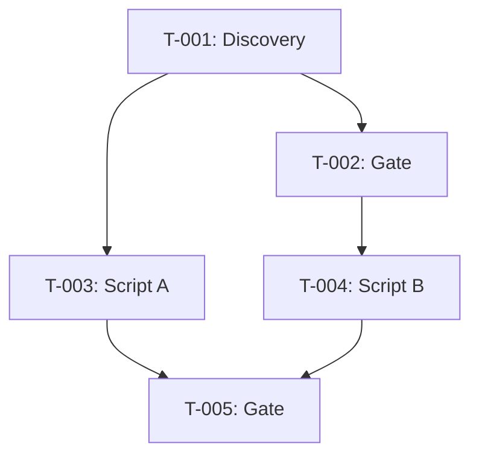

# Dependencies — <feature-id>

> The task dependency graph in table form — the single source of truth for which
> tasks block which others, with dependency classification (hard/soft) and notes.
> Generated by `dependency_graph.py` or filled manually for small plans.

---

## Graph summary

- **Total tasks**: <N>
- **Total dependencies**: <N>
- **Hard dependencies**: <N>
- **Soft dependencies**: <N>
- **Circular dependencies**: <N> (should be 0)
- **Orphan tasks**: <N> (should be 0 after verification)

---

## Dependency table

| Task ID | Depends on (hard) | Depends on (soft) | Blocks (hard) | Notes |
|---------|-------------------|-------------------|---------------|-------|
| T-001 | — (entry point) | — | T-002, T-003 | Discovery sweep; nothing precedes it. |
| T-002 | T-001 | — | T-004 | Consumes T-001 output. |
| T-003 | T-001 | T-002 | T-005 | Can start after T-001; T-002 is parallel-OK. |
| ... | | | | |

### Column guide

- **Task ID**: The task identifier from `TASKS.md` (e.g. `T-001`, `T-002a`).
- **Depends on (hard)**: Tasks that MUST complete before this task can start.
  If none, write `— (entry point)`.
- **Depends on (soft)**: Tasks that are recommended prerequisites but not
  strictly required — the task CAN start without them (higher rework risk if
  done out of order).
- **Blocks (hard)**: Tasks that cannot start until THIS task completes.
- **Notes**: Rationale for the dependency classification, cross-feature
  references, or conditions (e.g. "only if T-001 discovers real failures").

---

## Cross-feature dependencies

<Only if this feature depends on or is depended on by tasks in another feature.>

| This task | Depends on (external) | Feature | Status | Contract |
|-----------|----------------------|---------|--------|----------|
| T-015 | T-002 | F-019 | Not yet built | F-019 must ship T-002 before T-015 starts. |
| ... | | | | |

---

## Graph visualization

<Optional: paste the Mermaid or DOT graph from `dependency_graph.py --format mermaid`.>

