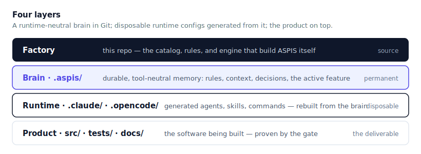
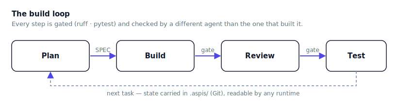

<div align="center">

<picture>
  <source media="(prefers-color-scheme: dark)" srcset="assets/brand/logo-dark.svg">
  
</picture>

### The shield for autonomous software production

A **file-first, deterministic** system for building software with AI agents —
where the *cheapest sufficient model* produces *production-grade* work, repeatably.


[Quickstart](docs/QUICKSTART.md) · [Architecture](docs/ARCHITECTURE.md) · [Roadmap](ROADMAP.md) · [Contributing](CONTRIBUTING.md)

</div>

---

## Why ASPIS

Frontier models are capable but inconsistent. ASPIS doesn't hope a model gets it
right — it **engineers the conditions** under which a cheap model can't get it wrong:

```text
Quality = model capability × task clarity × test strength × review discipline
```

Every piece of project state — plans, rules, traces, agent definitions — lives as
plain files in Git, so **any** AI runtime reads and writes the same source of truth.

<div align="center">
  
</div>

## Install

One command — it checks prerequisites, installs `uv` if missing, installs the global
`aspis`, and verifies:

```bash
# Linux / macOS
curl -fsSL https://raw.githubusercontent.com/mahmoud-emad-dev/aspis/main/install.sh | bash
```
```powershell
# Windows (PowerShell)
irm https://raw.githubusercontent.com/mahmoud-emad-dev/aspis/main/install.ps1 | iex
```

Other methods (clone, contributor, troubleshooting, uninstall): **[docs/INSTALL.md](docs/INSTALL.md)**.

## Quickstart

```bash
mkdir my-project && cd my-project
aspis init --write        # scaffold the brain (.aspis/) + runtime assets (.claude/, .opencode/)
aspis bootstrap --write   # make the project live (goal, stack, promote leads)
aspis models --sync       # assign each agent a model available on this machine
```

Then open **`AGENTS.md`** and start your runtime (OpenCode by default; add
`--runtime claude` for Claude Code). The factory drives a deterministic loop:

<div align="center">
  
</div>

The **[Quickstart](docs/QUICKSTART.md)** walks the whole first build with a worked example.

## Commands

```bash
aspis init <dir>        # scaffold an ASPIS project (dry-run; --write to apply)
aspis bootstrap         # onboarding: make an initialized project live
aspis status            # report project state
aspis models            # the model each agent resolves to, per runtime
aspis commit <paths…>   # compose a conventional message and commit (single writer)
aspis commits           # audit commit-message history (--fix repairs the auto-fixable)
aspis gitignore         # write/refresh .gitignore for the detected stack
aspis doctor            # check environment + project health (-v for paths + runtimes)
aspis uninstall         # remove machine-wide state (keeps project brains)
```

## Model intelligence

ASPIS routes each agent to the *cheapest sufficient* model — **per runtime**, because
the same agent can run on a different model under Claude than OpenCode. Agents declare a
*tier* (`cheap`/`standard`/`deep`), never a hard-coded model; a resolver translates that
to the exact model your connected providers expose, with per-agent and per-capability
overrides — all data, no code change. Detection is presence-only (no session or content
access).

## Documentation

- **[Install](docs/INSTALL.md)** — every install method, troubleshooting, uninstall.
- **[Quickstart](docs/QUICKSTART.md)** — clone → first build, with a worked example.
- **[Architecture](docs/ARCHITECTURE.md)** — how the factory is built.
- **[Roadmap](ROADMAP.md)** — the six parts: what's shipped, what's next, what isn't done.
- **[Testing](docs/TESTING.md)** — the manual acceptance pass.
- **[Contributing](CONTRIBUTING.md)** · **[Security](SECURITY.md)** · **[Changelog](CHANGELOG.md)**

> ⚠️ **Status: early beta.** Parts 1–2 of the six-part plan are shipped — install,
> onboarding, and the production system; tracing is next. The public API and CLI are
> not yet stable. See the **[Roadmap](ROADMAP.md)**.

## License

[MIT](LICENSE) © 2026 Mahmoud Emad
